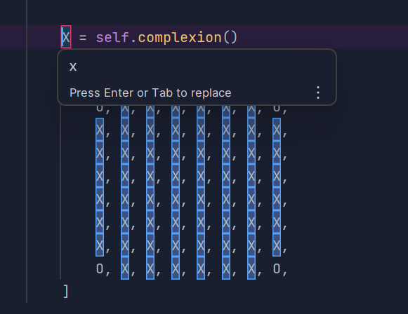

# Evidence and Knowledge

This document includes instructions and knowledge questions that must be completed to receive a *Competent* grade on this portfolio task.

## 1. Required evidence

### 1.1. Answer all questions in this document

- Each answer should be complete, well-articulated, and within the specified word count limits (if added) for each question.
- Please make sure **all** external sources are properly cited.
- You must **use your own words**. Please include your full chat transcripts if you use generative AI in any way.
- Generative AI hallucinates, is not an authoritative source

### 1.2. Make all the required modifications to the code

- Please follow the instructions in this document to make the changes needed to the code.

- When requested to upload evidence, upload all screenshots to `screenshots/` and embed them in this document. For example:

```markdown

```


> Note the `!`, and the use of a relative path.

- You must upload the code into your GitHub repository.
- While you can use a branch, your code should be in main when you submit.
- Upload a zip of this repository to Blackboard when you are ready to submit.
- You will be notified of your result via Blackboard
- However, if using GitHub classrooms, you may also receive additional feedback on GitHub directly

### 1.3. Optional: Use of Raspberry Pi and SenseHat

Raspberry Pi or SenseHat is **optional** for this activity. You can use the included `sense_hat.py` file to simulate the SenseHat on your computer.

If you use a Pi, please **delete** the `sense_hat.py` file.

### 1.4. Accessible version of the code

This project relies on visual patterns that appear on an LED matrix. If you have any accessibility requirements, you can use the `udl/accessible` branch to complete the project. This branch provides an accessible code version that uses text-based patterns instead of visual ones.

Please discuss this with your lecturer before using that branch.

## 2. Specific Tasks & Questions

Address the following tasks and questions based on the code provided in this repository.

### 2.1. Set up the project locally

1. Fork this repository (if not using GitHub Classrooms)
2. Clone your repository locally
3. Run the project locally by executing the `main.py` file
4. Evidence this by providing screenshots of the project directory structure and the output of the `main.py` file


If you are running on a Raspberry Pi, you can use the following command to run the project and then screenshot the result:

```bash
ls
python3 main.py
```

### 2.2. Fundamental code comprehension

 Answer each of the following questions **as they relate to that code** supplied by in this repository (ignore `sense_hat.py`):

1. Examine the code for the `smiley.py` file and provide  an example of a variable of each of the following types and their corresponding values (`_` should be replaced with the appropriate values):

   | Type                    | name                   | value                                   |
   | ----------              |------------------------|-----------------------------------------|
   | built-in primitive type | dimmed                 | True                                    |
   | built-in composite type | self.pixels            | A list of tuples containing RGB colours |
   | user-defined type       | self or self.sense_hat | Instance of the Smiley class/sense_hat  |

2. Fill in (`_`) the following table based on the code in `smiley.py`:

   | Object                   | Type   |
   | ------------             |--------|
   | self.pixels              | list   |
   | A member of self.pixels  | tuple  |
   | self                     | Smiley |

3. Examine the code for `smiley.py`, `sad.py`, and `happy.py`. Give an example of each of the following control structures using an example from **each** of these files. Include the first line and the line range:

   | Control Flow | File      | First line          | Line range |
   | ------------ |-----------|---------------------|------------|
   |  sequence    | smiley.py | Y = self.YELLOW     | 15-25      |
   |  selection   | sad.py    | if wide_open:       | 26         |
   |  iteration   | happy.py  | for pixel in mouth: | 21-22      |

4. Though everything in Python is an object, it is sometimes said to have four "primitive" types. Examining the three files `smiley.py`, `sad.py`, and `happy.py`, identify which of the following types are used in any of these files, and give an example of each (use an example from the code, if applicable, otherwise provide an example of your own):

   | Type                    | Used? | Example                          |
   | ----------------------- |-------|----------------------------------|
   | int                     | Yes   | mouth = [41, 46, 50, 51, 52, 53] |
   | float                   | Yes   | delay=0.25                       |
   | str                     | No    | No strings in those 3 files      |
   | bool                    | Yes   | dimmed=True                      |

5. Examining `smiley.py`, provide an example of a class variable and an instance variable (attribute). Explain **why** one is defined as a class variable and the other as an instance variable.

> Class Variable: `YELLOW = (255, 255, 0)`
>> Class variables like `YELLOW` are in a class level and are shared across all instances of the class.
>> They are used when the value is the exact same for all objects.

> Instance Variable: `self.pixels = [...]`
>> In parallel, instance variables such as `self.pixels` are unique to each instance.
>> Each smiley object could have a different set of pixels, so the data needs to be stored separately in each instance.

6. Examine `happy.py`, and identify the constructor (initializer) for the `Happy` class:
   1. What is the purpose of a constructor (in general) and this one (in particular)?

   > The purpose of a constructor like the `__init__` method, is used to initialize new objects when they are created and prepares the objects for use. 
   > In the Happy class, the base smiley face is set up using  `super().__init__()`

   2. What statement(s) does it execute (consider the `super` call), and what is the result?

   > The constructor executes `super().__init__()` to initialize the Smiley class, then calls `self.draw_mouth()` and `self.draw_eyes()`.
   > This results in a smiley object that's fully initialized, having its pixels updated to show a happy face.

### 2.3. Code style

1. What code style is used in the code? Is it likely to be the same as the code style used in the SenseHat? Give to reasons as to why/why not:

> The code follows PEP 8 Python styling guide. The indentation, naming conventions and docstrings are consistent with PEP 8.
>> It may not match the SenseHAT library's exact coding style for two reasons:
>>> 1. The SenseHAT library is an API which may focus more on performance and functionality than readability. 
>>> 2. The SenseHAT library is developed by various contributors, who may follow different coding standards.

2. List three aspects of this convention you see applied in the code.

> 1. Class names use PascalCase (Smiley, Happy, Sad)
> 2. snake_case is used for method and variable names (draw_eyes, dim_display)
> 3. Docstrings above methods and classes explain what they do.

3. Give two examples of organizational documentation in the code.

> The docstring for the Happy class explains its purpose - "Provides a Smiley with a happy expression", helping collaborators and users understand the use of this class.
> The method `dim_display()` has a docstring that describes what it does & how it works - "Dim the display if True, otherwise don't dim" 

### 2.4. Identifying and understanding classes

> Note: Ignore the `sense_hat.py` file when answering the questions below

1. List all the classes you identified in the project. Indicate which classes are base classes and which are subclasses. For subclasses, identify all direct base classes.
  
  Use the following table for your answers:

| Class Name | Super or Sub? | Direct parent(s)  |
|------------|---------------|-------------------|
| Smiley     | Super         | None              |
| Happy      | Sub           | Smiley, Blinkable |  
| Sad        | Sub           | Smiley            | 
| Blinkable  | Super         | ABC (module)      | 

2. Explain the concept of abstraction, giving an example from the project (note "implementing an ABC" is **not** in itself an example of abstraction). (Max 150 words)

> The concept of abstraction revolves around hiding the complicated parts of code and only showing what you need to use.
> In this project, the Smiley class takes on all the hard work, like setting up the LED lights and talking to SenseHAT.
> When we use something like `Happy.show()`, we don't need to know how it works, or what's happening inside Smiley, we just need to know when used it shows a happy face.
> This makes the code easier to use, understand and approach, without needing to know all the background details.

3. What is the name of the process of deriving from base classes? What is its purpose in this project? (Max 150 words)

> The process is called inheritance. It allows a class (a subclass) to use and build upon the code from another class (a base class).
> In this project, Happy and Sad inherit from Smiley, which means they automatically get its methods and setup (like `self.pixels` and `show()`) without hacing to write that code again.
> This makes for cleaner code and allows for each subclass to focus on what makes it different.

### 2.5. Compare and contrast classes

Compare and contrast the classes Happy and Sad.

1. What is the key difference between the two classes?
   > The key difference is that Happy inherits Blinkable, whereas Sad does not.
2. What are the key similarities?
   > Both classes inherit from Smiley, so they share the same setup. 
   > They both add or overwrite their own methods for drawing the mouth and eyes differently.
3. What difference stands out the most to you and why?
   > The difference that stands out most is the fact that Happy can blink, but Sad cannot.
   > This is because of the key difference I mentioned.
   > The lack of the blinking animation makes it seem very static.
4. How does this difference affect the functionality of these classes
   > The difference causes the inability to call the `blink()` on a Sad object, and if you do, it'll cause errors. 
   > However, it'll work perfectly fine if called on a Happy object. 

### 2.6. Where is the Sense(Hat) in the code?

1. Which class(es) utilize the functionality of the SenseHat?
   > The Smiley class uses SenseHat to show images on the LED grid. 
   > Happy and Sad inherit from Smiley, so they also use SenseHat by extension.
2. Which of these classes directly interact with the SenseHat functionalities?
   > Only the Smiley class interacts with SenseHat directly. 
   > It makes the SenseHat object and calls its methods.
3. Discuss the hiding of the SenseHAT in terms of encapsulation (100-200 Words)
   > The point of encapsulation is to keep the inner workings of how something works hidden inside a class, so any outside code doesn't need to consider it.
   > In this project, the Smiley class hides direct use of the SenseHat. 
   > It creates and uses the SenseHat object inside the class itself, and has simple methods like `show()` or `dim_display()` for other classes to use.
   > 
   > This means classes like Happy and Sad don't need to know anything about how the LED is controller, they just call `show()` when they want the face to .. show.
   > The actual code that talks to SenseHat is kept hidden away inside Smiley.
   > This makes it easier to use, read and maintain.
   > If the way the display works ever needs to change, only the Smiley class would need to be updated, not any other class that uses it.

### 2.7. Sad Smileys Can’t Blink (Or Can They?)

Unlike the `Happy` smiley, the current implementation of the `Sad` smiley does not possess the ability to blink. Let's first explore how blinking has been implemented in the Happy Smiley by examining the blink() method, which takes one argument that determines the duration of the blink.

**Understanding Blink Mechanism:**

1. Does the code's author believe that every `Smiley` should be able to blink? Explain.

> The author does not expect every Smiley to blink. 
> Only some smileys, like Happy, inherit from the Blinkable class, which enables blinking. 
> Sad does not blink by default, which shows that blinking is optional and only added to specific Smileys.

2. For those smileys that blink, does the author expect them to blink in the same way? Explain.

> The author expects Smileys that blink to use the same `blink()` method. 
> The Blinkable class works as a guide, and the Happy class follows the same blink pattern. 
> If Sad is given a blink method, it would be meant to work in a similar way.

3. Referring to the implementation of blink in the Happy and Sad Smiley classes, give a brief explanation of what polymorphism is.

> Polymorphism means that different classes could use the same method (like `blink()`) but have their own version of how it works. 
> For example, both Happy and Sad can have a `blink()` method, and they could each define it differently.

4. How is inheritance used in the blink method, and why is it important for polymorphism?

> Inheritance lets the Happy class use the Smiley base and the Blinkable class.
> Because it inherits from Blinkable, it can give its own version of `blink()`.
> This is important for polymorphism because it means any class that inherits from Blinkable can define `blink()` differently, even though it’s called the same way.

1. **Implement Blink in Sad Class:**

   - Create a new method called `blink` within the Sad class. Ensure you use the same method signature as in the Happy class:

   ```python
   def blink(self, delay=0.25):
       pass  # Replace 'pass' with your implementation
   ```

2. **Code Implementation:** Implement the code that allows the Sad smiley to blink. Use the implementation from the Happy Smiley as a reference. Ensure your new method functions similarly by controlling the blink duration through the `delay` argument.

3. **Testing the Implementation:**

- Test the new blink functionality on your Raspberry Pi or within the Python classes provided. You might need to adjust the `main.py` script to incorporate Sad Smiley's new blinking capability.

Include a screenshot of the sad smiley or the modified `main.py`:


- Observe and document the Sad smiley as it blinks its eyes. Describe any adjustments or issues encountered during implementation.

  > The implementation of the Sad smileys blinking was heavily influenced by the Happy smiley.
  > I had to ensure I imported `time` into `sad.py` along with `from sad import Sad` in `main.py`.
  > No major issues were found on my end.

  ### 2.8. If It Walks Like a Duck…

  Previously, you implemented the blink functionality for the Sad smiley without utilizing the class `Blinkable`. Assuming you did not use `Blinkable` (even if you actually did), consider how the Sad smiley could blink similarly to the Happy smiley without this specific class.

  1. **Class Type Analysis:** What kind of class is `Blinkable`? Inspect its superclass for clues about its classification.

     > Blinkable is a different kind of class, called an abstract base class (ABC).
     > Blinkable is inheriting from Pythons ABC class, which defines abstract classes. 
     > Abstract classes aren't meant to be used on their own, they are meant to be shared with other classes, like a template.

  2. **Class Implementation:** `Blinkable` is a class intended to be implemented by other classes. What generic term describes this kind of class, which is designed for implementation by others? **Clue**: Notice the lack of any concrete implementation and the naming convention.

  > A class like Blinkable is often called an interface or abstract class. 
  > It’s a class that sets up a method for other classes to fill in, but doesn’t do anything alone.

  3. **OO Principle Identification:** Regarding your answer to question (2), which Object-Oriented (OO) principle does this represent? Choose from the following and justify your answer in 1-2 sentences: Abstraction, Polymorphism, Inheritance, Encapsulation.

  > This represents abstraction. 
  > It hides the details of how blinking works, but states anything that can blink, should be using blinkable ("Specify what anything that claims to be 'blinkable' should be able to do.").
  > The actual blinking behavior is handled by each class that uses it.

  4. **Implementation Flexibility:** Explain why you could grant the Sad Smiley a blinking feature similar to the Happy Smiley's implementation, even without directly using `Blinkable`.

  > Even without using Blinkable, I can just add a `blink()` method directly to the Sad class. 
  > As long as the method name and behavior is similar, it will work all the same when called. 
  > The code doesn't care if it's using Blinkable or not, it only needs a method called `blink()`.

  5. **Concept and Language Specificity:** In relation to your response to question (4), what is this capability known as, and why is it feasible in Python and many other dynamically typed languages but not in most statically typed programming languages like C#? **Clue** This concept is hinted at in the title of this section.

  > This is called duck typing. 
  > In Python, if something has the right method, it can be used like any other object with that method. 
  > You don’t need to tell Python what “type” it is, unlike a lower level language like C#, where types have to be defined more strictly.

  ***

  ## 3. Refactoring

  ### 3.1. Does a Smiley Have to Be Yellow?

  While our current implementation predominantly features yellow smileys, emotional expressions like sickness or anger typically utilize colors like green, red, or orange. We'll explore the feasibility of integrating these colors into our smileys.

  1. **Defined Colors and Their Location:**

     1. Which colors are defined and in which class(s)?
        > The colors are defined in the Smiley class. 
        > They include WHITE, GREEN, YELLOW, RED and BLANK.
     2. What type of variables hold these colors? Are the values expected to change during the program's execution? Explain your answer.
        > The colors are stored as class variables using RGB tuples.
        > These values are not expected to change while the program is running.
     3. Add the color blue to the appropriate class using the appropriate format and values.

  2. **Usage of Color Variables:**

     1. In which classes are the color variables used?
        > The color variables are used in Smiley, Happy, and Sad, but the point of origin (and where it's inherited from) for the color variables is from the Smiley class.

  3. **Simple Method to Change Colors:**
  4. What is the easiest way you can think to change the smileys to green? Easiest, not necessarily the best!
     > The easiest way would be to change the RGB values of YELLOW to `(0, 255, 0)`, as I wouldn't need to change anything anywhere else for changes to take effect.

  Here's a revised version of the "Flexible Colors – Step 1" section for the smiley project, incorporating your specifications for formatting and content updates:

  ### 3.2. Flexible Colors – Step 1

  Changing the color of the smileys once is straightforward, but it isn't very flexible. To facilitate various colors for smileys, it is advisable not to hardcode values in any class. This approach was identified earlier as a necessary change. Let's start by removing the built-in assumptions about color in our classes.

  1. **Add a method called `complexion` to the `Smiley` class:** Implement this instance method to return `self.YELLOW`. Using the term "complexion" instead of "color" provides a more abstract terminology that focuses on the meaning rather than implementation.

  2. **Refactor subclasses to use the `complexion` method:** Modify any subclass that directly accesses the color variable to instead utilize the new `complexion` method. This ensures that color handling is centralized and can be easily modified in the future.

  3. **Determine the applicable Object-Oriented principle:** Consider whether Abstraction, Polymorphism, Inheritance, or Encapsulation best applies to the modifications made in this step.

  4. **Verify the implementation:** Ensure that the modifications function as expected. The smileys should still display in yellow, confirming that the new method correctly replaces the direct color references.

  This step is crucial for setting up a more flexible system for color management in the smiley display logic, allowing for easy adjustments and extensions in the future.

  ### 3.3. Flexible Colors – Step 2

  Having removed the hardcoded color values, we now enhance the base class to support dynamic color assignments more effectively.

  1. **Modify the `__init__()` method in the `Smiley` class:** Introduce a default argument named `complexion` and assign `YELLOW` as its default value. This allows the instantiation of smileys with customizable colors.

  2. **Introduce a new instance variable:** Create a variable called `my_complexion` and assign the `complexion` parameter to it. This step ensures that each smiley instance can maintain its own color state.

  3. **Rationale for `my_complexion`:** Using a distinct instance variable like `my_complexion` avoids potential conflicts with the method parameter names and clarifies that it is an attribute specific to the object.

  4. **Bulk rename:** We want to update our grid to use the value of complexion, but we have so many `Y`'s in the grid. Use your IDE's refactoring tool to rename all instances of the **symbol** `Y` to `X`. Where `X` is the value of the `complexion` variable. Include a screenshot evidencing you have found the correct refactor tool and the changes made.

  

  5. **Update the `complexion` method:** Adjust this method to return `self.my_complexion`, ensuring that whatever color is assigned during instantiation is what the smiley displays.

  6. **Verification:** Run the updated code to confirm that Smileys still defaults to yellow unless specified otherwise.

  ### 3.4. Flexible Colors – Step 3

  With the foundational changes in place, it's now possible to implement varied smiley colors for different emotional expressions.

  1. **Adjust the `Sad` class initialization:** In the `Sad` class's initializer method, change the superclass call to include the `complexion` argument with the value `self.BLUE`, as shown:

     ```python
     super().__init__(complexion=self.BLUE)
     ```

  2. **Test color functionality for the Sad smiley:** Execute the program to verify that the Sad smiley now appears blue.

  3. **Ensure the Happy smiley remains yellow:** Confirm that changes to the Sad smiley do not affect the default color of the Happy smiley, which should still display in yellow.

  4. **Design and Implement An Angry Smiley:** Create an Angry smiley class that inherits from the `Smiley` class. Set the color of the Angry smiley to red by passing `self.RED` as the `complexion` argument in the superclass call.

  ***
